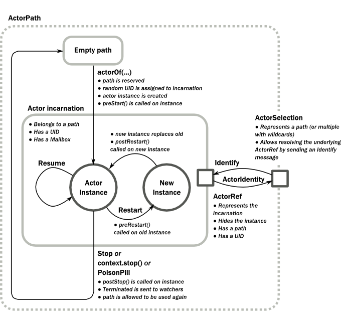

# scala-akka-http-actor-workshop
* references
    * https://medium.com/se-notes-by-alexey-novakov/crud-microservice-with-akkahttp-c914059bcf9f
    * https://www.manning.com/books/akka-in-action
    * https://doc.akka.io/docs/akka-http/10.2.1/
    * https://medium.com/akka-for-newbies/actor-lifecycle-94b05bd2f600

## preface
* https://github.com/mtumilowicz/scala213-functional-programming-collections-workshop (scala intro)
* https://github.com/mtumilowicz/kotlin-functional-programming-actors-workshop (actors intro)
    
## introduction
* two ultimate goals during software development
    1. complexity has to stay as low as possible
    1. resources must be used efficiently while you scale the application
* if we want to scale, the programming model has to be asynchronous
    * allows components to continue working while others haven’t responded yet
    * actor model chooses the abstraction of sending and receiving messages
* actors vs synchronous approach
    |                                   |actors   |synchronous approach   |
    |---                                |---      |---|
    |scaling                            |send and receive messages, no shared mutable state, immutable log of events    |mix of threads, shared mutable state in a CRUD database, and web service RPC calls   |
    |providing interactive information  |event-driven: push when the event occurs                                       |poll for current information    |
    |scaling out on the network         |asynchronous messaging, nonblocking I/O                                        |synchronous RPC, blocking I/O       |
    |handling failures                  |let it crash, isolate failure, and continue without failing parts              |handle all exceptions; only continue if everything works   |
* actors: decoupled on three axes
    * space/location
        * actor gives no guarantee and has no expectation about where another actor is located
    * time
        * actor gives no guarantee and has no expectation about when its work will be done
    * interface
        * nothing is shared between actors
        * information is passed in messages
    * if system coupled on all three axes can only exist on one runtime and will fail completely if 
    one of its components fails
        
## constructs
* ActorSystem
    * actors can create other actors, but who creates the first one?
        * first thing that every Akka application does is create an ActorSystem
    * typically one ActorSystem per JVM process
    * hierarchical group of actors which share common configuration
        * similar to URL path structure
            * ActorPath - unique path to an actor that shows the creation path up through the actor tree to the 
            root actor
            * every actor has a name (unique per level in the hierarchy)
                * generated automatically, but it’s a good idea to name all your actors
    * entry point for creating or looking up actors
    * is a heavyweight structure that will allocate threads, so create one per logical application
* ActorRef
    * ActorSystem returns an address (ActorRef) to the created top-level actor instead of the actor itself
        * makes sense - actor could be on another server
    * can be used to send messages to the actor
    * message -> ActorRef -> Mailbox -> Actor
* Dispatchers
    * in the real world, dispatchers are the communication coordinators responsible for receiving and passing 
    messages 
        * for example, emergency services 911 - the dispatchers are the people responsible for taking 
        in the call and passing on the messages to the other departments like the medical, fire station, 
        police, etc 
    * the main engine of an ActorSystem
    * responsible for selecting an actor and it’s messages and assigning them the CPU
        * actors are lightweight because they run on top of dispatchers
            * actors aren’t proportional to the number of threads
            * 2.7 million actors vs 4096 threads can fit in 1 GB
    * actors are invoked at some point by a dispatcher
        * dispatcher pushes the messages in the mailbox through the actors
    * configuring custom dispatcher
        ```
        context.spawn(yourBehavior, "DispatcherFromConfig", DispatcherSelector.fromConfig("your-dispatcher"))
        ```
        and `application.conf`
        ```
        my-dispatcher {
            # Dispatcher is the name of the event-based dispatcher
            type = Dispatcher
            # What kind of ExecutionService to use
            executor = "fork-join-executor"
            # Configuration for the fork join pool
            fork-join-executor {
                # Min number of threads to cap factor-based parallelism number to
                parallelism-min = 2
                # Parallelism (threads) ... ceil(available processors * factor)
                parallelism-factor = 2.0
                # Max number of threads to cap factor-based parallelism number to
                parallelism-max = 10
            }
            # Throughput defines the maximum number of messages to be
            # processed per actor before the thread jumps to the next actor.
            # Set to 1 for as fair as possible.
            throughput = 100
        }
        ```
* Actor = Behavior + Context (in which behavior is executed)
    * ActorContext
        * provides access to the Actor’s own identity ("self"), list of child actors, etc
        * `context.spawn()` creates a child actor
        * `system.spawn()` creates top level
    * Behavior
        * defines how actor reacts to the messages that it receives
        ```
        def apply(): Behavior[SayHello] =
            Behaviors.setup { context => // typically used as the outer most behavior when spawning an actor
                val greeter = context.spawn(HelloWorld(), "greeter")
            
                Behaviors.receiveMessage { message => // useful for when the context is already accessible by other means, like being wrapped in an [[setup]] or similar
                    val replyTo = context.spawn(HelloWorldBot(max = 3), message.name)
                    greeter ! HelloWorld.Greet(message.name, replyTo)
                    Behaviors.same
                }
            }
        ```
      
## supervision
* actor is the supervisor of the created child actor
* supervision hierarchy is fixed for the lifetime of a child actor
* actors that are most likely to crash should be as low down the hierarchy as possible
    * when a fault occurs in the top level of the actor system, it could restart all the
    top-level actors or even shut down the actor system.
* The supervisor doesn’t try to fix the actor or its state. 
    * It simply renders a judgment on how to recover, and then triggers the corresponding strategy
* mailbox for a crashed actor is suspended until the supervisor will decide what to do with the exception
* The supervisor has four options when deciding what to do with the actor:
    * Restart
        * The actor must be re-created from its Props
        * After it’s restarted (or rebooted, if you will), the actor will continue to process messages. 
        * Since the rest of the application uses an ActorRef to communicate with the actor, the new
        actor instance will automatically get the next messages.
    * Resume
        * The same actor instance should continue to process messages; 
        * the crash is ignored.
    * Stop
        * The actor must be terminated
        * It will no longer take part in processing messages.
    * Escalate
        * The supervisor doesn’t know what to do with it and escalates the problem to its parent, 
        which is also a supervisor

## failure
* actor provides two separate flows
    * one for normal logic - consists of actors that handle normal messages
    * one for fault recovery logic - consists of actors that monitor the actors in the normal flow
* instead of catching exceptions in an actor, we’ll just let the actor crash
    * no error handling or fault recovery logic in actor
* in most cases, you don’t want to reprocess a message, because it probably caused the error in the first place
    * Akka chooses not to provide the failing message to the mailbox again after a restart

## actor lifecycle
* actors do not stop automatically when no longer referenced
    * every actor that is created must also explicitly be destroyed
    * stopping a parent will also recursively stop all the child
* actor is automatically started by Akka when it’s created
* lifecycle: Started -> Stopped -> Terminated
    * started - can be restarted to reset the internal state of the actor
    * stopped - is disconnected from its ActorRef
        * ActorRef is redirected to the deadLettersActorRef of the actor system (special ActorRef that receives all 
        messages that are sent to dead actors)
    * terminated - can’t process messages anymore and will be eventually garbage collected
            * if the supervisor decides to stop the actor
            * if the stop method is used to stop the actor
            * if a PoisonPill message is sent to the actor
                * indirectly causes the stop method to be called
* there are several hooks, which are called when the events happen to indicate a lifecycle change
    
    * restart doesn’t stop the crashed actor in the same way as the stop methods
        * during restart - fresh actor instance is connected to the same ActorRef the crashed actor
        was using before the fault
        * stopped actor is disconnected from its ActorRef and redirected to the deadLettersActorRef
          
# akka http
* implements a full server/client-side HTTP stack on top of akka-actor and akka-stream
* provides a DSL to describe HTTP "routes" and how they should be handled
    * Route is the central concept of Akka HTTP’s Routing DSL
        ```
        type Route = RequestContext => Future[RouteResult]
        ```
        * when a route receives a request (RequestContext) it can do one of these things
            1. requestContext.complete(...) - given response is sent to the client as reaction to the request
            1. requestContext.reject(...) - route does not want to handle the request
            1. requestContext.fail(...) - 
        * RequestContext
            * wraps an HttpRequest instance to enrich it with additional information that are typically required 
            by the routing logic (ex. ExecutionContext)
        * RouteResult
            * simple abstract data type (ADT) that models the possible non-error results of a Route
            * Complete, Rejected
    * Directive
        * a small building block used for creating route structures
        * xxx
            ```
            val route: Route = { ctx => ctx.complete("yeah") } // standard way to build route
            val route: Route = _.complete("yeah") // scala syntax
            val route = complete("yeah") // complete directive
            ```
        * example
            ```
            val route: Route =
              path("order" / IntNumber) { id =>
                get {
                  complete {
                    "Received GET request for order " + id
                  }
                } ~
                put {
                  complete {
                    "Received PUT request for order " + id
                  }
                }
              }
            ```
    * PathMatcher
        * mini-DSL is used to match incoming URL’s and extract values from them
        * used in the path directive
        * example
            ```
            // matches /foo/bar
            path("foo" / "bar")
            ```
* marshalling and unmarshalling
    * marshalling - converting a higher-level (object) into lower-level representation, ex. a "wire format"
        * also called "serialization" or "pickling"
    * "unmarshalling" - reverse process to marshalling
        * also called "deserialization" or "unpickling"
    * is done separately from the route declarations
        * marshallers are pulled in implicitly using the "magnet" pattern
            * you can use any kind of object as long as there is an implicit marshaller available in scope
            * http://spray.io/blog/2012-12-13-the-magnet-pattern/ 
* Timeouts
    * idle-timeout - if a connection is open but no request/response is being written to it for over idle-timeout time, 
    the connection will be automatically closed.
    * request timeouts - limits the maximum time it may take to produce an HttpResponse from a route
        * if that deadline is not met the server will automatically inject a Service Unavailable HTTP response and 
        close the connection to prevent it from leaking and staying around indefinitely
